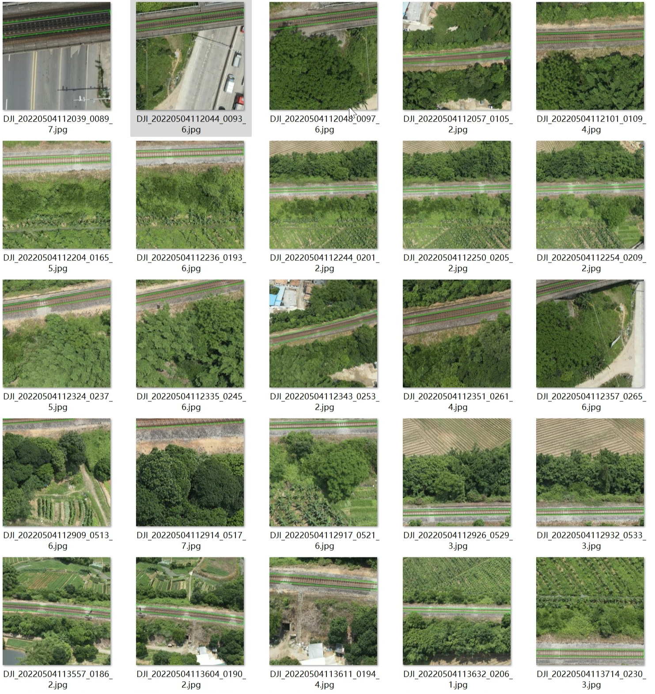
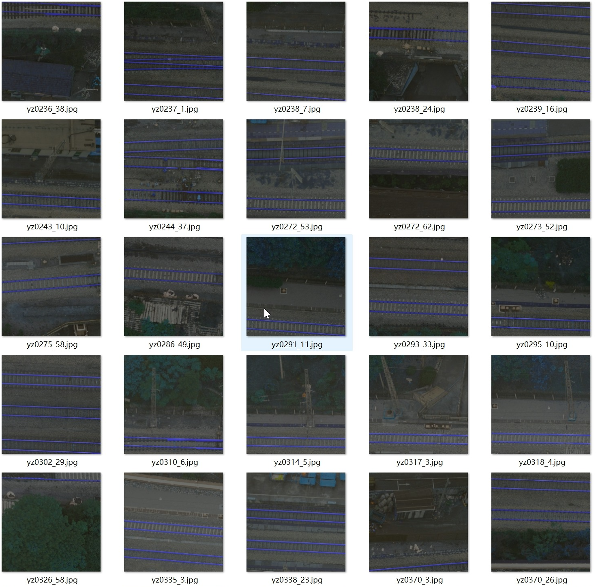

# Rail track detection and reconstruction in aeral images

## Video : Visualization of the Rail track detection and reconstruction.

[YouTube Link](https://www.youtube.com/watch?v=iy-kxUioIZw)

[Bilibili Link](https://www.bilibili.com/video/BV1XuKpeoEGo/?vd_source=64975fbfa2bf9b28bae890c59bdc16c8)

  

### Source code and datasets will comming soon!!!
## One can download parts of the dataset through the link, which contains totally 4000 image blocks and the ground truth for OBB-detection and segmentation of the rail track.

-Our datasets are organized according to the YOLOv11 format for [OBB-detection](https://docs.ultralytics.com/datasets/obb/#usage) and
[Segmentation](https://docs.ultralytics.com/datasets/segment/)

-We will publicly release all the images and annotations (approximately 45,000 images).

  
  

